## Pre Process E-Commerce Dataset Project
&nbsp;

The aim of this project is to import, clean, and pre-process an E-commerce dataset into a MySQL database, ready for data analytics. 

&nbsp;

## Milestone 1 - Import Raw Dataset

&nbsp;

__Raw Data__ 

The first step is to review the raw data located within OnlineRetail.csv.The raw data contains the following columns:

* Invoice No: The invoice number of the items.
* StockCode: The stock number of the items.
* Description: The description of the items.
* Quantity: The quantity of the items.
* UnitPrice: The unit price of the items.
* CustomerID: The customer ID.
* Country: The country of the customer.

&nbsp;

<ins>__Connect to the MySQL Database__</ins>

In order to connect to the MySQL Database the following code is written as shown in Figure 1 below:

<kbd><kbd>

*Figure 1 - Code to connect to MySQL Database*

&nbsp;

<ins>__Create Orders M Table__</ins>

The next step is to create a table called 'orders' with data types appropriate for each field using MySQL query. The table is shown in Figure 2 below.

<kbd>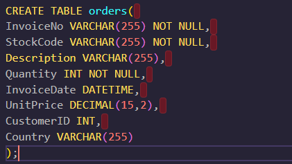<kbd> 

*Figure 2 - Query to create table*

&nbsp;

<ins>__Import the raw data into MySQL Table__</ins>

Now that the table has been created in MySQL, the raw data can now be imported into the MySQL table as shown in Figure 3 below. The __STR_TO_Date__ function is called to convert the invoice date into the correct format. The appropriate arguments are also called for in the stated CSV format.

<kbd>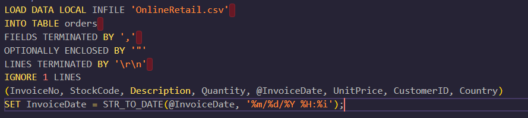<kbd>

*Figure 3 - Query to import raw csv data into MySQL table*

&nbsp;

<ins>__Review Table__</ins>

The next step is to review created table to ensure that the raw data has correctly been formatted and inputted into the correct columns, which is shown in Figure 4 below.

&nbsp;

<kbd>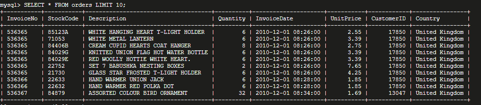<kbd>

*Figure 4 - Query to review orders table*

&nbsp;

## Milestone 2 - Analyse the Missing Customer IDs and devise plan to impute them

&nbsp;

__Raw Data__ 

On inspection, the raw data contains many missing rows of customerID which are imported with a 0 value. To conduct a thorough analysis of the data each CustomerID must have a unique identifier. Hence the first step is to confirm how many missing rows are within the table to gauge what needs to be done with these missing rows, for example, if the missing rows account for more than 5% then these rows do not need to be dropped but instead be inputted with artificial Customer IDs instead.

&nbsp;

<kbd>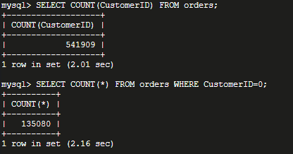<kbd>

*Figure 5 - Query to count the number of rows in the table and the number of rows with missing customer id data*

&nbsp;

Figure 5 shows that the rows with the missing customer IDs account for a significant proportion of the rows (25%) and therefore it was decided to fill the missing rows with artificial customer IDs. The next step is to explore some rows to ensure that the rows with missing customer IDs have valid invoice numbers associated with them. (Figure 6).

<kbd>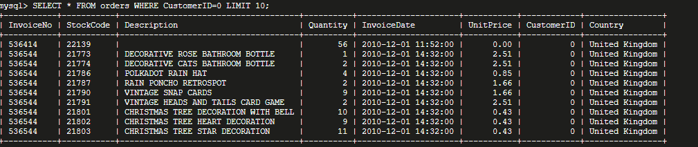<kbd> 

*Figure 6 - Query to review orders table*

&nbsp;

The next step is to determine how many imputed customer IDs we will need to be generated, by computing the number of distinct invoice numbers that have missing customer IDs as shown in Figure 7 below.

&nbsp;

<kbd>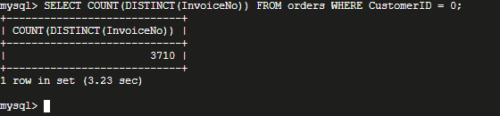<kbd>

*Figure 7 - Query to count missing customer IDs based on unique invoice numbers*

&nbsp;

The final step of milestone 2 is to find the smallest valid Customer ID in the data set, to ensure that an auto-incremented imputed customer ID will not overlap with actual values (Figure 8).

&nbsp;

<kbd>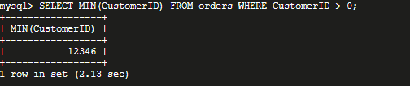<kbd>

*Figure 8 - Query to the find smallest valid Customer ID*

&nbsp;

## Milestone 3 - Impute New Customer IDs for rows without them

&nbsp;

__New Table__ 

As mentioned in Milestone 2 above it was decided to impute artificial customer IDs for rows that are missing them. The strategy is to generate an auto-incremented customer ID, starting at 1, associated with each unique invoice that is missing a customer ID (Figure 9). The next step is to make sure that the auto-incremented imputed_id values start at 1 as shown in Figure 10 below and preview the table (11). 

&nbsp;

<kbd>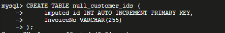<kbd>

*Figure 9 - Query to create null_customer_ids table *

&nbsp;

<kbd>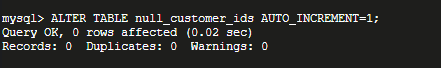<kbd>

*Figure 10 - Query to auto increment imputed id values*

&nbsp;

<kbd>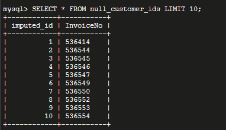<kbd>

*Figure 11 - Query to review null_customer_ids table *

&nbsp;

The next step is to confirm the imputed IDs remain within the expected range, that does not overlap with the real IDs (Figure 12):

<kbd>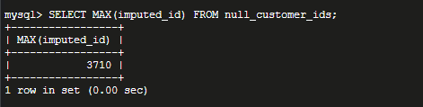<kbd> 

*Figure 12 - Query to confirm imputed IDs expected range*

&nbsp;

__Join Table__ 

To ensure the join of the null_customer_ids with orders tables is performed efficiently, indexes on the InvoiceNo columns of both tables are created as shown in Figure 13 and Figure 14 below.

&nbsp;

<kbd><kbd>

*Figure 13 - Query to crete index of the InvoiceNo column for the null_customer_ids table*

&nbsp;

<kbd>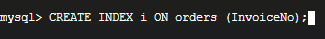<kbd>

*Figure 14 - Query to crete index of the InvoiceNo column for the orders table*

&nbsp;

__Inner join__ 

Now that the indexes are created, an inner join is conducted to merge the imputed IDs with rows with missing customer IDs, joined by the invoice number as shown in Figure 15, and the confirmation that there are now no missing Customer IDs is shown in Figure 16 below.

&nbsp;

<kbd>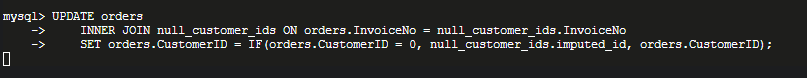<kbd>

*Figure 15 - Query to create inner join for both tables*

&nbsp;

<kbd>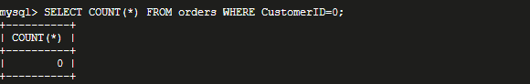<kbd>

*Figure 16 - Query to confirm the number of missing rows*

The final step is to inspect some of the rows with imputed IDs (these may be identified as being less than 12346) to ensure they appear as expected (Figure 17).

&nbsp;

<kbd>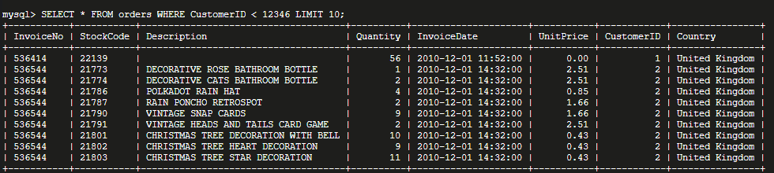<kbd>

*Figure 17 - Query to review orders table*

&nbsp;

## Milestone 4 - Identify rows that do not represent customer orders

&nbsp;

On inspection, the data contains rows for accounting corrections, fees, and other expenses that do not represent real customer behavior, and this data must be cleaned out prior to analysing it.

&nbsp;

__Unit Price__ 

These data entries are often associated with high UnitPrice values or zero or negative UnitPrice values. Therefore the first step is to inspect rows with high UnitPrice values(Figure 18) and see if there is a better way to identify these expense-related entries. Also, inspect rows with negative or zero UnitPrice, and see if there are any hints as to what these rows represent and if they may be dropped.

&nbsp;

<kbd>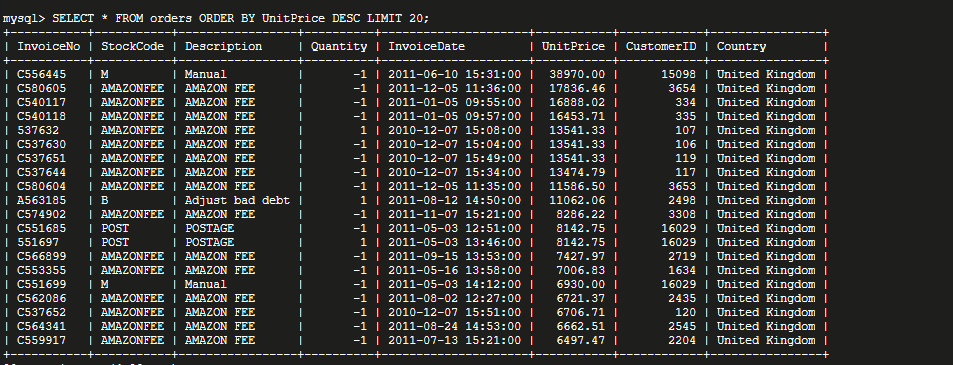<kbd>

*Figure 18 - Query to inspect UnitPrice rows*

&nbsp;

__StockCode__ 

On inspection, the StockCode field contains information identifying rows that do not reflect actual purchases of items. Hence the next step is to 
list the unique StockCode values associated with these outliers (Figure 19).

&nbsp;

<kbd>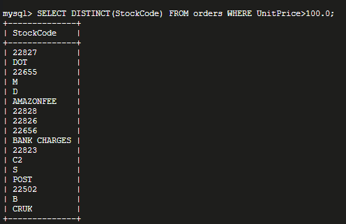<kbd>

*Figure 19 - Query to inspect StockCode field*

&nbsp;

The final step OF milestone 4 is to inspect rows with zero or negative UnitPrice fields. On inspection, It is not clear what these rows represent, but they do seem to be missing valid item description data and picked up imputed customer IDs. As they are missing significant data, dropping these rows seems justifiable. 

<kbd>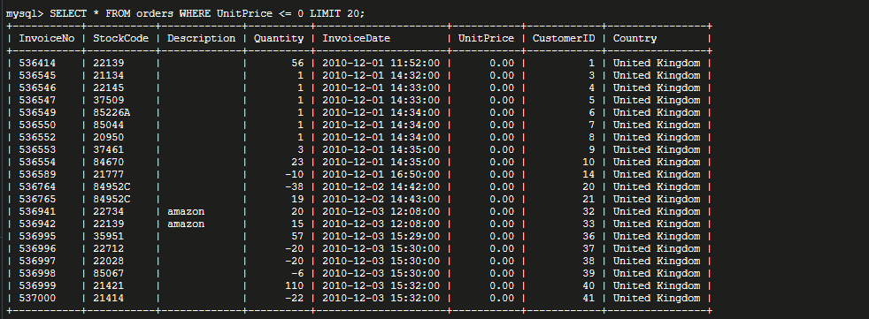<kbd>

*Figure 20 - Query to inspect rows with zero or negative UnitPrice fields*

&nbsp;

## Milestone 5 - Drop rows that do represent customer orders

&nbsp;

__Drop rows__ 

The next step is to drop rows from the orders table that have zero or negative UnitPrice values. Also, rows that do not reflect the purchase of real items need to be dropped(Figure 21). These may be identified by a StockCode of DOT, M, D, S, POST, BANK CHARGES, C2, AMAZONFEE, CRUK, or B (Figure 22). The resulting orders table will be clean and ready for further analysis.

&nbsp;

<kbd>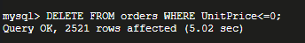<kbd>

*Figure 21 - Query to drop rows*

&nbsp;

<kbd>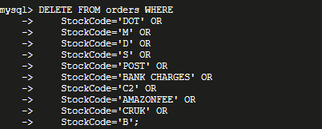<kbd>

*Figure 22 - Extra Query to drop rows*

&nbsp;

The final step of the data cleaning process is to confirm the results in the table where the highest UnitPrice values reflect actual customer behavior as shown in Figure 23 below.

<kbd>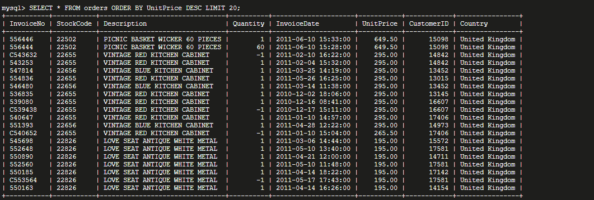<kbd>

*Figure 23 - Query to confirm results*

&nbsp;

The table is now ready to be used for data analytics.